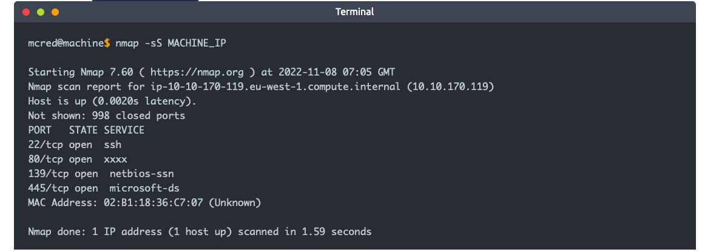
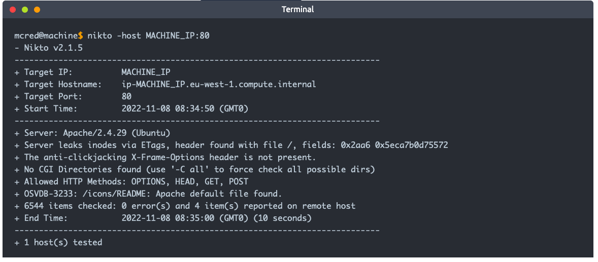
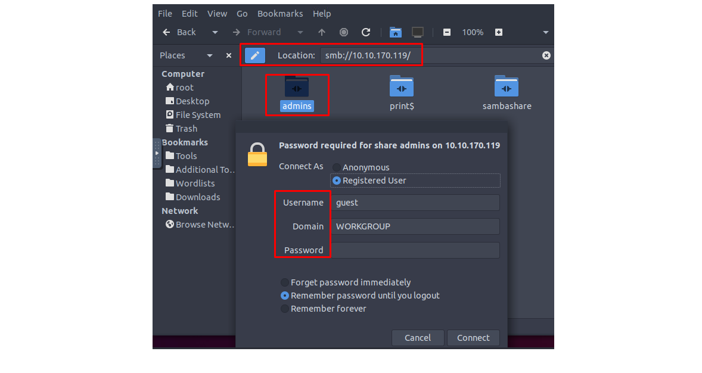

# Day 4

# My Notes

Lots of great information in the sections below. 

# My Results

## Videos of work


# <center>The Story</center>


Check out HuskyHack's video walkthrough for Day 4 here!
During the investigation of the downloaded GitHub repo (OSINT task), elf Recon McRed identified a URL qa.santagift.shop that is probably used by all the elves with admin privileges to add or delete gifts on the Santa website. The website has been pulled down for maintenance, and now Recon McRed is scanning the server to see how it's been compromised. Can you help McRed scan the network and find the reason for the website compromise?

## Learning Objectives

- What is Scanning?
- Scanning types
- Scanning techniques
- Scanning tools

## What is Scanning
Scanning is a set of procedures for identifying live hosts, ports, and services, discovering the operating system of the target system, and identifying vulnerabilities and threats in the network. These scans are typically automated and give an insight into what could be exploited. Scanning reveals parts of the attack surface for attackers and allows launching targeted attacks to exploit the system.

## Scanning Types
Scanning is classified as either active or passive based on the degree of intrusiveness to gathering information about a target system or network, as explained below:

- __Passive Scanning__: This method involves scanning a network without directly interacting with the target device (server, computer etc.). Passive scanning is usually carried out through packet capture and analysis tools like Wireshark; however, this technique only provides basic asset information like OS version, network protocol etc., against the target.
- __Active Scanning__: Active scanning is a scanning method whereby you scan individual endpoints in an IT network to retrieve more detailed information. The active scan involves sending packets or queries directly to specific assets rather than passively collecting that data by "catching" it in transit on the network's traffic. Active scanning is an immediate deep scan performed on targets to get detailed information. These targets can be a single endpoint or a network of endpoints.

## Scanning Techniques
The following standard techniques are employed to scan a target system or network effectively.

### Network Scanning
A network is usually a collection of interconnected hosts or computers to share information and resources. Network scanning helps to discover and map a complete network, including any live computer or hosts, open ports, IP addresses, and services running on any live host and operating system. Once the network is mapped, an attacker executes exploits as per the target system and services discovered. For example, a computer in a network with an outdated Apache version enables an attacker to launch an exploit against a vulnerable Apache server.

### Port Scanning
Per Wikipedia, "In computer networking, a port is a number assigned to uniquely identify a connection endpoint and to direct data to a specific service. At the software level, within an operating system, a port is a logical construct that identifies a specific process or a type of network service".

Port scanning is a conventional method to examine open ports in a network capable of receiving and sending data. First, an attacker maps a complete network with installed devices/ hosts like firewalls, routers, servers etc., then scans open ports on each live host. Port number varies between 0 to 65,536 based on the type of service running on the host. Port scanning results fall into the following three categories:
- Closed Ports: The host is not listening to the specific port.
- Open Ports: The host actively accepts a connection on the specific port.
- Filtered Ports: This indicates that the port is open; however, the host is not accepting connections or accepting connections as per certain criteria like specific source IP address.

### Vulnerability Scanning
The vulnerability scanning proactively identifies the network's vulnerabilities in an automated way that helps determine whether the system may be threatened or exploited. Free and paid tools are available that help to identify loopholes in a target system through a pre-build database of vulnerabilities. Pentesters widely use tools such as Nessus and Acunetix to identify loopholes in a system.

## Scanning Tools
### Network Mapper (Nmap)
Nmap is a popular tool used to carry out port scanning, discover network protocols, identify running services, and detect operating systems on live hosts. You can learn more about the tool by visiting rooms Nmap,  Nmap live host discovery, Nmap basic port scan and Nmap advanced port scan rooms on TryHackMe.

Deploy the virtual machine by clicking Start Machine at the top right of this task. This is the machine Recon McRed wants to scan.

You can access the tools needed by clicking the Start AttackBox button above. Wait for the AttackBox to load, and launch the terminal from the Desktop. Type nmap in the AttackBox terminal.  A quick summary of important Nmap options is listed below:

- TCP SYN Scan: Get the list of live hosts and associated ports on the hosts without completing the TCP three-way handshake and making the scan a little stealthier. 


Usage: ```nmap -sS MACHINE_IP```



- Ping Scan: Allows scanning the live hosts in the network without going deeper and checking for ports services etc. Usage: nmap -sn MACHINE_IP.
- Operating System Scan: Allows scanning of the type of OS running on a live host. Usage: nmap -O MACHINE_IP.
- Detecting Services: Get a list of running services on a live host. 
 
Usage: 

nmap -sV MACHINE_IP

### Nikto
Nikto is open-source software that allows scanning websites for vulnerabilities. It enables looking for subdomains, outdated servers, debug messages etc., on a website. You can access it on the AttackBox by typing:

nikto -host MACHINE_IP.

  


Elf Recon McRed ran Nmap and Nikto tools against the QA server to find the list of open ports and vulnerabilities. He noticed a Samba service running - hackers can gain access to the system through loosely protected Samba share folders that are not protected over the network. He knows that The Bandit Yeti APT got a few lists of admin usernames and passwords for qa.santagift.shop using OSINT techniques.

Let's connect to the Samba service using the credentials we found through the source code (OSINT task). Type the following command smb://MACHINE_IP in the address bar and use the following username and password:

    Username: ubuntu
    Password: S@nta2022


