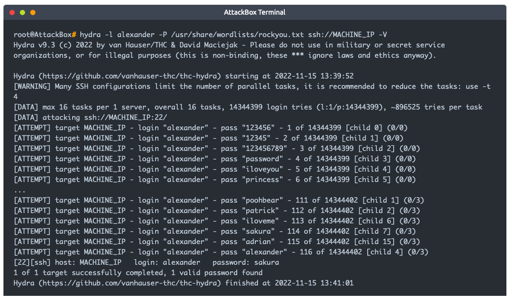
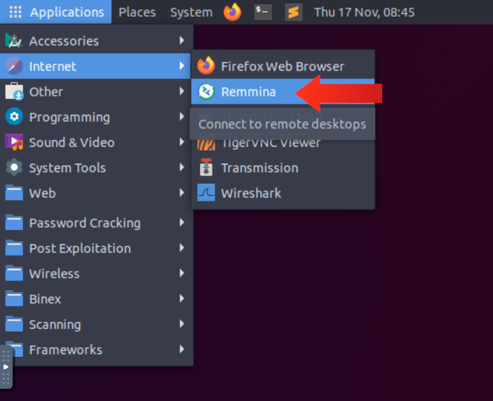
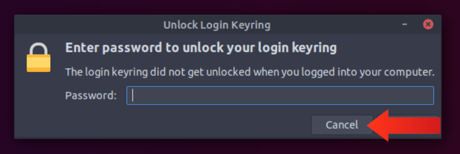
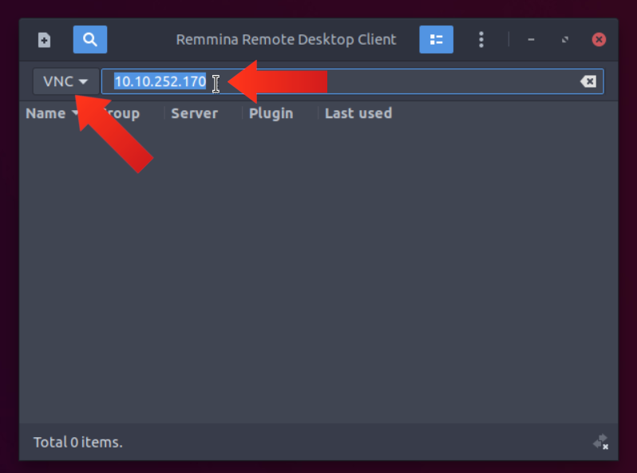

# Day 5

# My Notes 

This task is to learn how to use hydra and the password that is gathered to connect to a remove vnc server and gather the flag for the challenge.

### My Answers
VNC screenshot for this task

My Results

# 
The Story

Check out Phillip Wylie's video walkthrough for Day 5 here!
Elf McSkidy asked Elf Recon McRed to search for any backdoor that the Bandit Yeti APT might have installed. If any such backdoor is found, we would learn that the bad guys might be using it to access systems on Santa’s network.
## Learning Objectives

- Learn about common remote access services.
- Recognize a listening VNC port in a port scan.
- Use a tool to find the VNC server’s password.
- Connect to the VNC server using a VNC client.

## Remote Access Services

You can easily control your computer system using the attached keyboard and mouse when you are at your computer. How can we manage a computer system that is physically in a different place? The computer might be in a separate room, building, or country. The need for remote administration of computer systems led to the development of various software packages and protocols. We will mention three examples:

1. SSH
2. RDP
3. VNC

_SSH_ stands for _Secure Shell_. It was initially used in Unix-like systems for remote login. It provides the user with a command-line interface (CLI) that can be used to execute commands.

_RDP_ stands for _Remote Desktop Protocol_; it is also known as Remote Desktop Connection (RDC) or simply Remote Desktop (RD). It provides a graphical user interface (GUI) to access an MS Windows system. When using Remote Desktop, the user can see their desktop and use the keyboard and mouse as if sitting at the computer.

VNC stands for Virtual Network Computing. It provides access to a graphical interface which allows the user to view the desktop and (optionally) control the mouse and keyboard. VNC is available for any system with a graphical interface, including MS Windows, Linux, and even macOS, Android and Raspberry Pi.

Based on our systems and needs, we can select one of these tools to control a remote computer; however, for security purposes, we need to think about how we can prove our identity to the remote server.
Authentication

Authentication refers to the process where a system validates your identity. The process starts with the user claiming a specific unique identity, such as claiming to be the owner of a particular username. Furthermore, the user needs to prove their identity. This process is usually achieved by one, or more, of the following:

1. Something you know refers, in general, to something you can memorize, such as a password or a PIN (Personal Identification Number).
2. Something you have refers to something you own, hardware or software, such as a security token, a mobile phone, or a key file. The security token is a physical device that displays a number that changes periodically.
3. Something you are refers to biometric authentication, such as when using a fingerprint reader or a retina scan.

Back to remote access services, we usually use passwords or private key files for authentication. Using a password is the default method for authentication and requires the least amount of steps to set up. Unfortunately, passwords are prone to a myriad of attacks.

##Attacking Passwords

Passwords are the most commonly used authentication methods. Unfortunately, they are exposed to a variety of attacks. Some attacks don’t require any technical skills, such as shoulder surfing or password guessing. Other attacks require the use of automated tools.

The following are some of the ways used in attacks against passwords:

1. Shoulder Surfing: Looking over the victim’s shoulder might reveal the pattern they use to unlock their phone or the PIN code to use the ATM. This attack requires the least technical knowledge.
2. Password Guessing: Without proper cyber security awareness, some users might be inclined to use personal details, such as birth date or daughter’s name, as these are easiest to remember. Guessing the password of such users requires some knowledge of the target’s personal details; their birth year might end up as their ATM PIN code.
3. Dictionary Attack: This approach expands on password guessing and attempts to include all valid words in a dictionary or a word list.
4. Brute Force Attack: This attack is the most exhaustive and time-consuming, where an attacker can try all possible character combinations.

Let’s focus on dictionary attacks. Over time, hackers have compiled one list after another of passwords leaked from data breaches. One example is RockYou’s list of breached passwords, which you can find on the AttackBox at /usr/share/wordlists/rockyou.txt. The choice of the word list should depend on your knowledge of the target. For instance, a French user might use a French word instead of an English one. Consequently, a French word list might be more promising.

RockYou’s word list contains more than 14 million unique passwords. Even if we want to try the top 5%, that’s still more than half a million. We need to find an automated way.

## Hacking an Authentication Service

To start the AttackBox and the attached Virtual Machine (VM), click on the “Start the AttackBox” button and click on the “Start Machine” button. Please give it a couple of minutes so that you can follow along.

On the AttackBox, we open a terminal and use Nmap to scan the target machine of IP address MACHINE_IP. The terminal window below shows that we have two listening services, SSH and VNC. Let’s see if we can discover the passwords used for these two services.
        

We want an automated way to try the common passwords or the entries from a word list; here comes THC Hydra. Hydra supports many protocols, including SSH, VNC, FTP, POP3, IMAP, SMTP, and all methods related to HTTP. You can learn more about THC Hydra by joining the Hydra room. The general command-line syntax is the following:

__hydra -l username -P wordlist.txt server service__ where we specify the following options:

- -l username: -l should precede the username, i.e. the login name of the target. You should omit this option if the service does not use a username.
- -P wordlist.txt: -P precedes the wordlist.txt file, which contains the list of passwords you want to try with the provided username.
- server is the hostname or IP address of the target server.
- service indicates the service in which you are trying to launch the dictionary attack.

Consider the following concrete examples:

- hydra -l mark -P /usr/share/wordlists/rockyou.txt MACHINE_IP ssh will use mark as the username as it iterates over the provided passwords against the SSH server.
- hydra -l mark -P /usr/share/wordlists/rockyou.txt ssh://MACHINE_IP is identical to the previous example. MACHINE_IP ssh is the same as ssh://MACHINE_IP.

You can replace ssh with another protocol name, such as rdp, vnc, ftp, pop3 or any other protocol supported by Hydra.

There are some extra optional arguments that you can add:

- -V or -vV, for verbose, makes Hydra show the username and password combinations being tried. This verbosity is very convenient to see the progress, especially if you still need to be more confident in your command-line syntax.
-  -d, for debugging, provides more detailed information about what’s happening.
-  The debugging output can save you much frustration; for instance, if Hydra tries to connect to a closed port and timing out, -d will reveal this immediately.

In the terminal window below, we use Hydra to find the password of the username alexander that allows access via SSH.

        

You can experiment by repeating the same command hydra -l alexander -P /usr/share/wordlists/rockyou.txt ssh://MACHINE_IP -V on the AttackBox’s terminal. The password of the username alexander was found to be sakura, the 114th in the rockyou.txt password list. In TryHackMe tasks, we expect any attack to finish within less than five minutes; however, the attack would usually take longer in real-life scenarios. Options for verbosity or debugging can be helpful if you want Hydra to update you about its progress.

## Connecting to a VNC Server

Many clients can be used to connect to a VNC server. If you are connecting from the AttackBox, we recommend using Remmina. To start Remmina, from the Applications menu in the upper right, click on the Internet group to find Remmina.

If you get a dialog box to unlock your login keyring, click Cancel.

We need to select the VNC protocol and type the IP address of the target system, as shown in the figure below.

